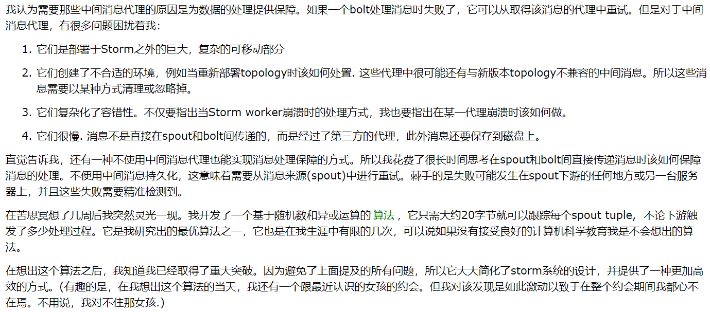

## 实时计算概述


---

### 目录

ul

 - 分布式系统和实时计算
 - Zookeeper
 - Storm
 - Kafka
 - 在业务中使用storm
 - 讨论

@ulend

---

### 分布式系统

>***Storm是开源的、分布式、流式计算系统***

 - 分布式系统是把计算或存储任务放在多个主机上，提高扩展性

---


---

Hadoop诞生


Hadoop和hive作为全量数据处理最著名的工具，具有吞吐量、自动容错等优点，在海量数据计算上具有很强的优势

---

### Hadoop的局限

>高延迟
>只能处理全量数据
>运维复杂

 - 广告点击
 - 电商推荐

---

### 实时计算


---

### 实时计算要解决哪些问题
@ul

 - 低延迟
 - 高性能
 - 分布式
 - 可扩展
 - 容错性

@ulend

---

## Zookeeper


---

### zookeeper

 官方说辞：Zookeeper 分布式服务框架是Apache Hadoop 的一个子项目，它主要是用来解决分布式应用中经常遇到的一些数据管理问题，如：统一命名服务、状态同步服务、集群管理、分布式应用配置项的管理等。
 
***分布式协调服务框架***
***解决分布一致性问题***
***本质：分布式小文件存储系统 + 通知机制***

---

### 分布式一致性

#### CAP
对于一个分布式系统，不可能同时兼顾三点：
 - 一致性（Consistency）
 - 可用性（Availability）
 - 分区容错性（Partition Tolerance）

---

#### 弱一致性（高可用性和分区容错性）
@ul

 - DNS
 - Cassandra

@ulend


#### 强一致性（高一致性和分区容错性）
@ul

 - Master Slave(Redis): 高一致性、低可用性
 - Paxos
 - Raft
 - ZAB

@ulend

---

### zookeeper提供了什么

#### 特性
>全局数据一致
可靠性
顺序性
原子性
实时性

---

### zookeeper提供了什么

#### 文件系统
@ul

- znode：
	- 兼有文件和目录两种特性
	- 具有原子性操作
	- 每个节点存储大小有严格限制，一般都是几KB
	- 必须绝对路径引用

@ulend

---

### zookeeper提供了什么

#### 通知机制

 - 在客户端监听注册它关心的节点，一旦数据发生改变都会受到通知

---

### zookeeper的典型应用场景

### 配置管理
在zk上管理服务的配置内容。订阅者是所有使用配置的服务
服务在启动时可以从ZK获取需要的配置，设置监听事件

---

#### 命名服务
利用zk的全局一致性，上下游的服务可以在zk约定好path相互探索发现

---

#### 分布式锁
>
***保持独占***
创建同名的节点作为锁。创建成功就获得了锁并操作某个文件

***控制时序***
根据ZK创建临时节点的序列化特性，根据创建节点的先后来访问文件

---

#### 集群管理
@ul

- 机器的加入和退出
	- 加入和退出时创建或删除相应的节点
- master选举
	- 类似于分布式独占锁

@ulend

---

## Storm


---

### Apache Storm是一个*分布式的、可靠的、容错的*实时数据流处理框架

---

### 基本概念
#### topology
拓扑结构，构成了一个在storm中运行的实例应用。拓扑描述了消息的流动形式
就是一个有向无环图


---
@ul

#### spout
 - 在拓扑中充当数据源的角色。通常spout会从外部读取数据，然后转换为tuple数据形式，并输出

#### bolt
 - 接收数据并执行处理。bolt可以执行过滤、函数操作、合并、写入数据库等任何操作。bolt是被动的角色

#### tuple
 - storm中数据流的抽象，本质上就是` List<Object>`， 经过序列化后在组件之间传输

@ulend

---

### Storm集群架构


---

#### 组件
@ul

 - **nimbus：**主节点，负责资源分配和任务调度
 - **supervisor：**工作节点。负责接受nimbus分配来的任务，管理自己的worker进程（每个工作节点的worker数可以在配置文件中配置，配置几个端口就对应几个worker）
 - **worker：**运行处理具体逻辑的进程，在配置中一个端口对应一个进程
 - **executor：**物理线程，可以手动设置数量
 - **task：**一个任务的最小单位，多个task可能会公用一个线程

@ulend

---

#### 一个简单的例子


---

```java
public class SplitSentenceBolt extends BaseRichBolt {

    private OutputCollector collector;

    public void prepare(Map stormConf, TopologyContext context, OutputCollector collector) {
        this.collector=collector;
        System.out.println("------------SplitSentenceBolt prepare called------------");
    }

    public void execute(Tuple input) {
        String sentence = input.getStringByField("sentence");
        String[] words = sentence.split(" ");
        for (String word : words) {
            collector.emit(new Values(word));//向下一个bolt发射数据
        }
        collector.ack(input);
    }

    public void declareOutputFields(OutputFieldsDeclarer declarer) {
        declarer.declare(new Fields("word"));
    }

}
```

---

```java
public class WordCountBolt extends BaseRichBolt {
    private OutputCollector collector;

    private HashMap<String, Long> counts = null;

    public void prepare(Map stormConf, TopologyContext context, OutputCollector collector) {
        this.collector = collector;
        this.counts = new HashMap<String, Long>();
    }

    public void execute(Tuple input) {
		String word = input.getStringByField("word");
        Long count = counts.get(word);
        if (count == null) {
            count = 0L;
        }
        count++;
        counts.put(word, count);
        collector.emit(new Values(word,count));
        collector.ack(input);
    }

    public void declareOutputFields(OutputFieldsDeclarer declarer) {
        declarer.declare(new Fields("word","count"));
    }

}
```

---

```java
public class ReportBolt extends BaseRichBolt {

    private HashMap<String, Long> counts = null;

    public void prepare(Map stormConf, TopologyContext context, OutputCollector collector) {

        this.counts = new HashMap<String, Long>();
    }

    public void execute(Tuple input) {
		String word = input.getStringByField("word");
        Long count = input.getLongByField("count");
        counts.put(word, count);
        
        System.out.println("结果: "+this.counts);
    }

    public void declareOutputFields(OutputFieldsDeclarer declarer) {
    }
}
```

---

### Zookeeper在storm中的作用

1. 客户端提交拓扑到nimbus

---

### Zookeeper在storm中的作用

2. Nimbus针对该拓扑建立本地的目录根据topology的配置计算task，分配task，在zookeeper上建立assignments节点存储task和supervisor机器节点中woker的对应关系

---

### Zookeeper在storm中的作用

3. 在zookeeper上创建taskbeats节点来监控task的心跳；启动topology

---

### Zookeeper在storm中的作用

4. Supervisor去zookeeper上获取分配的tasks，启动多个woker；根据topology信息初始化建立task之间的连接；后整个拓扑运行起来

---

### storm的并发度


---

### storm容错性机制
@ul

#### **如果一个worker意外死亡**
 - supervisor会重启它。如果它在启动时连续失败多次，那么会在一段时间内一直没有发送心跳给nimbus，这个时候nimbus会在另一台主机上重新分配worker

#### **如果一个集群中的主机宕机了**
 - 那么在这台主机上的任务都会停止，nimbus会重新分配这些任务

@ulend

---

### storm容错性机制
@ul

#### **如果nimbus和supervisor守护进程不幸死亡**
 - storm将nimbus和supervisor设计成***快速失败***（碰到意外情况进程立刻毁灭）和无状态（状态在zk或本地文件上）的
 - 使用daemontools监控，并立即重启
 - 守护进程的死亡并不影响worker（独立的进程，worker的心跳并不直接与supervisor和nimbus交互）

#### **某种意义上storm是单点故障（SPOF）的**
 - 如果nimbus宕机了，worker并不会直接受到影响，还会继续工作
 - 在必需nimbus时，就会受到影响
 - 在1.x版本之后，已经可以配置多个nimbus备选节点，解决了单点问题

@ulend

---

### storm可靠性机制

#### 什么是fully processed?
 >Storm的可靠性是指Storm会告知用户每一个消息单元是否在一个指定的时间(timeout)内被完全处理。
 >完全处理的意思是该MessageId绑定的源Tuple以及由该源Tuple衍生的所有Tuple都经过了Topology中每一个应该到达的Bolt的处理。

---

#### Acker组件

 - 一种特殊的task，负责追踪tuple流
 - messageId根据一致性哈希选择负责的Acker
 - Acker使用简单的异或算法来确定tuple是否完全处理

---



---


---

